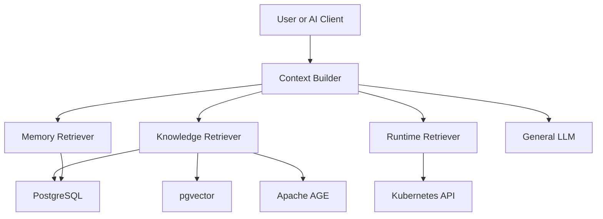

# AI Knowledge Base

A team-oriented engineering knowledge platform that continuously indexes engineering sources and makes coding, deployment, local testing, architecture, and operational knowledge available to AI across sessions.

## Goals

The project is designed to provide three distinct context layers:

- **Knowledge** — durable engineering knowledge extracted from repositories and verified sources.
- **Memory** — decisions and prior engineering experience that should persist across AI sessions.
- **Runtime** — live operational state such as Kubernetes workloads, Pods, status, and logs.

The initial product focus is intentionally narrower: prove that GitHub repository content can be indexed, retrieved semantically, and used to generate grounded answers with traceable evidence before adding graph, runtime, memory, and agent orchestration capabilities.

## Architecture



PostgreSQL is the durable source of truth. pgvector provides semantic retrieval and Apache AGE provides relationship traversal. Runtime Kubernetes state is fetched live instead of being persisted as long-term knowledge whenever practical.

## Current Status

The project is currently at **M0 — Foundation**.

Implemented foundation components include:

- Python 3.12 project structure;
- YAML-based non-sensitive configuration;
- `.env` / environment-based secrets;
- async SQLAlchemy database lifecycle;
- initial Repository, Document, Chunk, and IndexJob models;
- PostgreSQL schema and migration/bootstrap SQL;
- pgvector embedding column and HNSW index;
- Apache AGE extension and graph bootstrap SQL;
- DocumentStore, VectorStore, GraphStore, and MemoryStore boundaries;
- PostgreSQL DocumentStore adapter;
- pgvector VectorStore adapter;
- initial unit-test scaffolding.

M0 is not considered complete until the application can connect to an externally supplied PostgreSQL environment and verify PostgreSQL, pgvector, and AGE through integration tests and readiness checks.

The project does **not** start or provision its own database. Database infrastructure is supplied externally.

## Database Strategy

| Capability | Technology | Responsibility |
| --- | --- | --- |
| Canonical storage | PostgreSQL | repositories, documents, chunks, indexing state, metadata, and later memory |
| Semantic search | pgvector | chunk embeddings and vector similarity search |
| Knowledge graph | Apache AGE | engineering entities, relationships, and multi-hop traversal |

Vector and graph data are treated as derived projections and should remain rebuildable from canonical repository content.

## Configuration

Configuration is separated by sensitivity.

`config/app.yml` contains non-sensitive configuration such as database host, port, database name, connection-pool settings, feature flags, graph name, model IDs, and embedding dimension.

`.env` or process environment variables contain secrets only, such as database credentials, GitHub tokens, and model API keys.

Example:

```yaml
database:
  driver: postgresql+asyncpg
  host: localhost
  port: 5432
  name: ai_knowledge_base
  pool_size: 10
  max_overflow: 20

pgvector:
  enabled: true

age:
  enabled: true
  graph_name: ai_knowledge_graph

embedding:
  model_id: text-embedding-model
  dimension: 1024
```

```env
POSTGRES_USER=ai_kb_user
POSTGRES_PASSWORD=change-me
# GITHUB_TOKEN=
# EMBEDDING_API_KEY=
# GENERAL_LLM_API_KEY=
```

The application builds the PostgreSQL DSN internally. Credentials are never stored in `config/app.yml`.

## Milestones

### M0 — Foundation

Build a reliable application and persistence foundation before implementing repository ingestion.

Key outcomes:

- PostgreSQL lifecycle and schema are operational;
- pgvector and Apache AGE availability can be verified;
- storage and model-provider boundaries are defined;
- health and readiness checks exist;
- database and vector integration tests pass against an externally supplied PostgreSQL environment.

**Acceptance:** the application can start with supplied configuration and credentials, verify PostgreSQL/pgvector/AGE, insert an embedding, and execute a vector similarity search.

### M1 — Knowledge Ingestion MVP

Build the first complete ingestion pipeline, initially focusing on Markdown and text sources.

```text
GitHub Repository
  -> Repository Registration
  -> Git Sync
  -> File Scanner
  -> Markdown/Text Parser
  -> Chunker
  -> PostgreSQL
  -> Embedding Provider
  -> pgvector
```

Key outcomes:

- repository registration;
- full repository indexing;
- incremental commit comparison;
- Markdown/text parsing and chunking;
- content-hash based change detection;
- embedding batching;
- retryable index jobs;
- deleted content invalidation.

**Acceptance:** the initial test repositories can be fully indexed and incrementally updated, while unchanged chunks are not embedded again.

### M2 — Search and RAG MVP

Turn indexed repository content into grounded engineering answers.

```text
Question
  -> Query Embedding
  -> pgvector Top-K
  -> Metadata Filter
  -> Reranker
  -> Context Builder
  -> General LLM
  -> Answer with Evidence
```

Key outcomes:

- semantic search;
- repository and metadata filtering;
- reranker integration boundary;
- canonical chunk retrieval;
- grounded context construction;
- answer generation;
- repo/path/commit references;
- retrieval evaluation dataset and baseline metrics.

**Acceptance:** known engineering questions retrieve expected evidence and generated answers include traceable repository sources.

M2 is the first complete product MVP: **GitHub -> Knowledge -> AI Answer**.

### M3 — Engineering Knowledge Graph

Add relationship-aware retrieval after the basic RAG pipeline is proven useful.

Initial entities include Repository, Service, API, Database, Deployment, and Technology. Initial relationships include CONTAINS, DEPENDS_ON, CALLS, USES, EXPOSES, and DEPLOYED_BY.

Structured sources such as Kubernetes YAML, Helm, OpenAPI, package manifests, and Dockerfiles should use deterministic parsers first. LLM extraction is reserved for semantic or ambiguous relationships.

Graph extraction is not part of the critical ingestion path. AGE is a derived projection built from canonical PostgreSQL knowledge.

**Acceptance:** relationship-heavy questions can perform multi-hop traversal and every returned graph fact can be traced back to repository evidence.

### M4 — Runtime Context

Connect durable engineering knowledge to live Kubernetes state.

```text
Repository
  -> Service or Workload Mapping
  -> Cluster and Namespace
  -> Deployment or StatefulSet
  -> Label Selector
  -> Kubernetes API
  -> Current Pods, Status, and Logs
```

Key outcomes:

- stable repository-to-workload mapping;
- Kubernetes ServiceAccount and least-privilege RBAC;
- workload, Pod, status, and log tools;
- runtime authorization and audit logging;
- separation between live runtime evidence and durable knowledge.

Ephemeral Pod names are not stored as durable graph facts.

**Acceptance:** the system can resolve a repository or service to its current Kubernetes workload and retrieve live operational evidence for troubleshooting.

### M5 — Memory and Agent Platform

Combine Knowledge, Memory, and Runtime into a unified AI context platform.

The first memory implementation remains PostgreSQL-backed and focuses on decision and episodic memory. Specialized memory frameworks are evaluated only when temporal or high-volume memory requirements justify them.

LangGraph is introduced at this stage as the orchestrator that decides when a request requires Knowledge, Memory, Runtime, or a combination of them.

Key outcomes:

- decision memory;
- episodic engineering memory;
- cross-session retrieval;
- explicit memory promotion and invalidation rules;
- LangGraph orchestration;
- bounded MCP/Agent tools;
- authorization, tracing, and guardrails.

**Acceptance:** a new AI session can reuse important prior engineering decisions and experiences while combining them with repository knowledge and live runtime context.

## Development Principle

Do not introduce graph extraction, long-term memory frameworks, or LangGraph orchestration before the core ingestion and RAG pipeline has demonstrated value.

The implementation priority is:

```text
GitHub
  -> PostgreSQL
  -> pgvector
  -> Retrieval
  -> LLM
  -> Grounded Engineering Answer
```

Then extend the proven core with:

```text
Knowledge Graph
  -> Runtime Context
  -> Memory
  -> Agent Orchestration
```

This keeps the project focused on delivering usable engineering knowledge rather than becoming an infrastructure framework before the core retrieval problem is solved.

## Planned Stack

- Python 3.12+
- FastAPI
- Pydantic / pydantic-settings
- PyYAML
- PostgreSQL
- pgvector
- Apache AGE
- existing embedding model
- existing general LLM
- Kubernetes Python client
- LangGraph in M5
- Docker / Kubernetes
- Prometheus
- MCP / FastMCP

## Detailed Plan

See [`docs/implementation-plan.md`](docs/implementation-plan.md) for implementation details, data models, APIs, extraction rules, testing strategy, and milestone task breakdowns.
