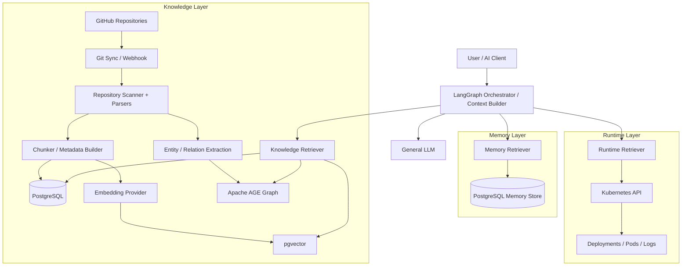
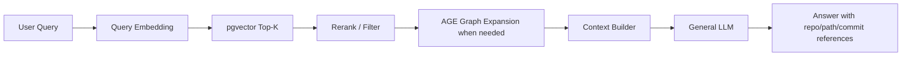

# AI Knowledge Base

A team-oriented engineering knowledge platform that continuously indexes GitHub repositories and makes coding, deployment, local testing, architecture, and operational knowledge available to LLMs across sessions.

## Goals

- Index Markdown, source code, comments, Helm, Kubernetes YAML, Dockerfiles, and CI/CD configuration from multiple GitHub repositories.
- Support semantic retrieval with embeddings.
- Model important engineering entities and relationships as a graph.
- Keep authoritative repository content and indexing metadata in one durable database platform.
- Add cross-session AI memory without mixing memory with canonical engineering knowledge.
- Allow runtime tools to resolve a repository to Kubernetes workloads and inspect current Pods/logs when a question requires live state.
- Expose the same application services through FastAPI, Agent tools, and MCP.

## Target Architecture



## Database Strategy

The project now standardizes on **PostgreSQL** as the database platform.

| Capability | Choice | Role |
| --- | --- | --- |
| Canonical document and metadata store | PostgreSQL | repositories, documents, chunks, index jobs, source metadata, permissions, memory records |
| Vector search | pgvector | embedding storage and semantic similarity search |
| Graph | Apache AGE | repository/service/API/database/deployment relationships and multi-hop traversal |

This replaces the earlier MongoDB + replaceable external Vector DB plan. PostgreSQL remains the source of truth; pgvector and AGE are logical capabilities within the same database platform.

## Knowledge Model

Initial entities:

- Repository
- Service
- API
- Database
- Technology
- Deployment
- Kubernetes workload
- Document

Initial relationships:

- `CONTAINS`
- `DEPENDS_ON`
- `CALLS`
- `USES`
- `EXPOSES`
- `DEPLOYED_BY`
- `DESCRIBES`

Prefer deterministic parsers for structured files such as Kubernetes YAML, Helm, OpenAPI, `pom.xml`, and package manifests. Use the general LLM only for semantic extraction that cannot be reliably parsed with rules.

## Retrieval Flow



Graph traversal is optional per query. Straightforward semantic questions can be answered from pgvector + PostgreSQL alone; relationship-heavy questions can expand through AGE.

## Runtime Kubernetes Flow

Runtime state is not stored as long-term knowledge when it can be queried live.

```text
repo
  -> graph/metadata mapping
  -> cluster + namespace + Deployment/StatefulSet + selector
  -> Kubernetes API
  -> current Pods
  -> Pod logs / status
  -> LLM analysis
```

The Kubernetes connector should use a dedicated ServiceAccount with least-privilege RBAC. Dex is not required for the service-to-cluster connection; introduce user-aware OIDC/RBAC only when different users must inherit different runtime permissions.

## Memory Layer

Knowledge, memory, and runtime context remain separate concepts:

- **Knowledge**: durable engineering facts extracted from repositories and verified sources.
- **Memory**: decisions, prior troubleshooting episodes, user/team preferences, and cross-session context.
- **Runtime**: live Kubernetes state such as Pods, logs, events, and metrics.

Start with a simple PostgreSQL-backed memory store behind a `MemoryStore` port. LangGraph can orchestrate retrieval across the three layers. A specialized memory framework such as Graphiti/Zep or Mem0 can be introduced later if temporal fact invalidation, consolidation, or complex episodic retrieval becomes necessary.

## Planned Stack

- Python 3.12+
- FastAPI
- Pydantic
- PostgreSQL
- pgvector
- Apache AGE
- Existing embedding model
- Existing general LLM
- LangGraph for future agent orchestration
- Kubernetes Python client for runtime tools
- Docker / Kubernetes
- Prometheus metrics
- MCP / FastMCP for external AI clients

## Roadmap

1. **Foundation** — PostgreSQL schema, ports/adapters, model clients, tests.
2. **Indexing MVP** — Git sync, parser/chunker, incremental indexing, pgvector writes.
3. **Retrieval MVP** — vector retrieval, filters, reranking, citations.
4. **RAG Answering** — grounded context builder and LLM answer generation.
5. **Knowledge Graph** — entity/relation schema, extraction, AGE upsert and graph traversal.
6. **Runtime Layer** — repo-to-workload mapping and Kubernetes Pod/log tools.
7. **Memory Layer** — cross-session decision/episodic memory behind a stable port.
8. **MCP / Agent** — expose knowledge, memory, and runtime tools through one orchestrator.

See [`docs/implementation-plan.md`](docs/implementation-plan.md) for the detailed implementation plan.
