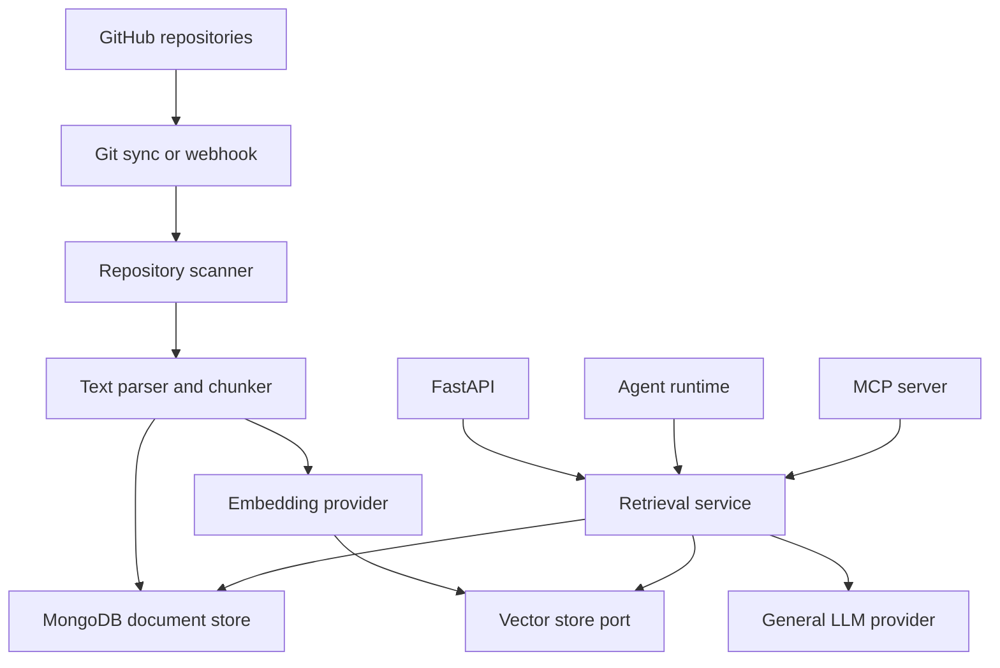
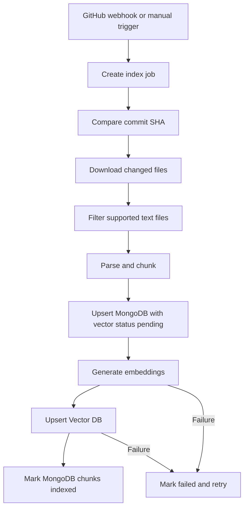
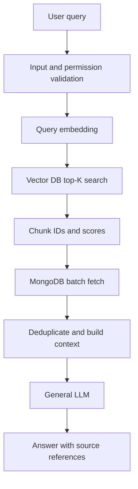

# AI Knowledge Base Implementation Plan

## 1. Goal

Build a Python-first, text-only knowledge base that:

- indexes Markdown, source code, comments, and infrastructure configuration from GitHub;
- uses an existing text embedding model for semantic retrieval;
- uses an existing general LLM for grounded answer generation;
- stores canonical text and metadata in MongoDB;
- keeps the Vector DB replaceable;
- can later be exposed as Agent tools or an MCP server for other AI clients;
- excludes image parsing, OCR, image embeddings, and image storage.

## 2. Architecture Principles

1. MongoDB is the source of truth for documents, chunks, metadata, and indexing state.
2. The Vector DB is a derived search index and must be rebuildable from MongoDB.
3. Application services depend on Python protocols, not database SDKs.
4. Model providers are replaceable through embedding and LLM ports.
5. FastAPI, Agent tools, and MCP tools reuse the same application services.
6. The first MCP release is read-only.
7. Every answer includes repository, path, commit, and heading references.

## 3. Target Architecture



## 4. Initial Technology Stack

| Area | Initial choice | Replaceable |
| --- | --- | --- |
| Language | Python 3.12+ | No |
| HTTP API | FastAPI | Yes, but not required |
| Validation | Pydantic | Yes |
| Text database | MongoDB | Yes, through `DocumentStore` |
| Vector database | Undecided | Yes, through `VectorStore` |
| Embedding | Existing embedding model | Yes, through `EmbeddingProvider` |
| Generation | Existing general LLM | Yes, through `LLMProvider` |
| Background work | Dramatiq or Celery | Yes |
| Deployment | Docker and Kubernetes | Yes |
| Metrics | Prometheus endpoint | Yes |
| MCP | Python MCP SDK / FastMCP | Yes |

The MVP can use an in-memory vector adapter for development until the production Vector DB is selected.

## 5. Repository Layout

```text
ai-knowledge-base/
├── apps/
│   ├── api/
│   │   └── main.py
│   ├── worker/
│   │   └── main.py
│   ├── mcp_server/
│   │   └── server.py
│   └── agent/
│       └── agent.py
├── src/
│   └── knowledge_base/
│       ├── domain/
│       │   ├── models.py
│       │   └── exceptions.py
│       ├── application/
│       │   ├── indexing_service.py
│       │   ├── retrieval_service.py
│       │   ├── answer_service.py
│       │   └── reindex_service.py
│       ├── ports/
│       │   ├── document_store.py
│       │   ├── vector_store.py
│       │   ├── embedding_provider.py
│       │   ├── llm_provider.py
│       │   └── source_repository.py
│       └── adapters/
│           ├── document_stores/
│           │   └── mongodb.py
│           ├── vector_stores/
│           │   ├── memory.py
│           │   ├── qdrant.py
│           │   ├── milvus.py
│           │   └── pgvector.py
│           ├── models/
│           │   ├── embedding_client.py
│           │   └── llm_client.py
│           └── github/
│               ├── client.py
│               └── webhook.py
├── tests/
│   ├── unit/
│   ├── integration/
│   └── evaluation/
├── deploy/
│   ├── docker/
│   ├── helm/
│   └── kubernetes/
├── docs/
├── pyproject.toml
└── README.md
```

## 6. Core Python Ports

### 6.1 Embedding Provider

```python
from typing import Protocol, Sequence


class EmbeddingProvider(Protocol):
    @property
    def dimension(self) -> int: ...

    async def embed_documents(
        self,
        texts: Sequence[str],
    ) -> list[list[float]]: ...

    async def embed_query(
        self,
        text: str,
    ) -> list[float]: ...
```

### 6.2 General LLM Provider

```python
from typing import Protocol, Sequence
from dataclasses import dataclass


@dataclass
class ChatMessage:
    role: str
    content: str


class LLMProvider(Protocol):
    async def generate(
        self,
        messages: Sequence[ChatMessage],
        temperature: float = 0.0,
    ) -> str: ...
```

### 6.3 Document Store

```python
from typing import Protocol, Sequence


class DocumentStore(Protocol):
    async def connect(self) -> None: ...
    async def close(self) -> None: ...
    async def upsert_documents(self, documents: Sequence[object]) -> None: ...
    async def upsert_chunks(self, chunks: Sequence[object]) -> None: ...
    async def get_chunk(self, chunk_id: str) -> object | None: ...
    async def get_chunks(self, chunk_ids: Sequence[str]) -> list[object]: ...
    async def delete_document_chunks(self, document_id: str) -> None: ...
    async def mark_chunks_indexed(
        self,
        chunk_ids: Sequence[str],
        index_version: str,
    ) -> None: ...
```

### 6.4 Vector Store

```python
from typing import Protocol, Sequence
from dataclasses import dataclass


@dataclass
class VectorRecord:
    id: str
    vector: list[float]
    metadata: dict


@dataclass
class VectorMatch:
    id: str
    score: float
    metadata: dict


class VectorStore(Protocol):
    async def connect(self) -> None: ...
    async def close(self) -> None: ...

    async def ensure_collection(
        self,
        collection_name: str,
        dimension: int,
    ) -> None: ...

    async def upsert(
        self,
        collection_name: str,
        records: Sequence[VectorRecord],
    ) -> None: ...

    async def search(
        self,
        collection_name: str,
        query_vector: list[float],
        top_k: int,
        filters: dict | None = None,
    ) -> list[VectorMatch]: ...

    async def delete(
        self,
        collection_name: str,
        ids: Sequence[str],
    ) -> None: ...
```

## 7. MongoDB Data Model

### `repositories`

- `_id`
- `owner`
- `name`
- `default_branch`
- `last_indexed_commit`
- `enabled`
- `created_at`
- `updated_at`

### `documents`

- `_id`
- `repository_id`
- `path`
- `title`
- `document_type`
- `branch`
- `commit_sha`
- `content_hash`
- `raw_text`
- `metadata`
- `index_status`
- `created_at`
- `updated_at`
- `deleted_at`

### `chunks`

- `_id`
- `document_id`
- `repository_id`
- `chunk_index`
- `heading_path`
- `content`
- `token_count`
- `content_hash`
- `commit_sha`
- `vector_status`
- `vector_index_version`
- `embedding_model`
- `embedding_dimension`
- `retry_count`
- `metadata`
- `created_at`
- `updated_at`

### `index_jobs`

- `_id`
- `repository_id`
- `commit_sha`
- `status`
- `files_scanned`
- `documents_updated`
- `chunks_created`
- `error`
- `started_at`
- `finished_at`

## 8. Vector Record Contract

The Vector DB stores embeddings and references, not the canonical full text.

```json
{
  "id": "chunk-id",
  "vector": [0.012, -0.038, 0.104],
  "metadata": {
    "document_id": "document-id",
    "repository_id": "repo-id",
    "branch": "main",
    "commit_sha": "abc123",
    "document_type": "markdown",
    "index_version": "embedding-v1"
  }
}
```

Search returns chunk IDs and scores. Full chunk text is batch-loaded from MongoDB.

## 9. Indexing Flow



Initial supported inputs:

- Markdown and README files;
- Python source and comments;
- YAML and YML;
- Dockerfiles;
- Helm charts;
- Kubernetes manifests;
- GitHub Actions workflows.

Initial chunking targets:

- 400 to 800 tokens per chunk;
- 50 to 100 token overlap;
- Markdown split by heading hierarchy;
- source code split by class or function when possible;
- YAML split by top-level key or Kubernetes resource;
- stable metadata for repository, branch, path, commit, and heading.

## 10. Cross-Database Consistency

MongoDB and the Vector DB do not share a transaction. Indexing therefore uses an idempotent state machine:

```text
pending -> embedding -> vector_upsert -> indexed
                    \-> failed -> retry
```

Requirements:

- MongoDB is written before the Vector DB.
- `content_hash` prevents unnecessary re-embedding.
- every Vector DB upsert uses a stable chunk ID;
- retries must be idempotent;
- stale vectors are deleted after a successful replacement;
- a reconciliation job compares MongoDB state with Vector DB state;
- a complete Vector DB rebuild can be started from MongoDB.

## 11. Retrieval and Answer Flow



MVP retrieval behavior:

1. Generate a query embedding.
2. Apply repository and authorization filters before or during vector search.
3. Request approximately 20 candidates.
4. Batch-fetch canonical chunks from MongoDB.
5. Remove duplicate or stale results.
6. Select approximately 5 to 10 chunks within the context budget.
7. Ask the LLM to answer only from retrieved context.
8. Return repository, path, heading, commit SHA, and score.

## 12. FastAPI Endpoints

```text
POST /v1/search
POST /v1/answer
GET  /v1/documents/{document_id}
GET  /v1/repositories
POST /v1/repositories/{repository_id}/index
GET  /v1/index-jobs/{job_id}
POST /internal/github/webhook
GET  /health/live
GET  /health/ready
GET  /metrics
```

`/v1/search` performs retrieval only. `/v1/answer` performs retrieval and LLM generation. This separation lets Agents and MCP clients retrieve knowledge without causing a second LLM call.

## 13. Configuration

```env
DOCUMENT_STORE_BACKEND=mongodb
MONGODB_URI=mongodb://mongodb:27017
MONGODB_DATABASE=ai_knowledge_base

VECTOR_STORE_BACKEND=memory
VECTOR_STORE_URL=
VECTOR_STORE_API_KEY=
VECTOR_COLLECTION=knowledge_chunks_v1

EMBEDDING_MODEL_ID=text-embedding-model
EMBEDDING_DIMENSION=1024
EMBEDDING_INDEX_VERSION=embedding-v1

GENERAL_LLM_MODEL_ID=general-llm
```

The embedding dimension must be configuration, not a Python constant. A model change with a different dimension creates a new vector collection and index version.

## 14. MCP Expansion

The MCP server wraps application services and never accesses MongoDB or the Vector DB directly.

Initial read-only tools:

```text
search(query, repository_ids?, top_k?)
fetch(id)
list_repositories()
get_index_status(repository_id)
```

`search` returns result IDs, titles, and canonical URLs. `fetch` returns full text and metadata. The MCP layer uses explicit schemas and read-only safety annotations.

Development transport:

- STDIO for local testing;
- Streamable HTTP for Kubernetes and remote AI clients;
- OAuth or service authentication for private knowledge.

## 15. Agent Expansion

The first Agent uses the Knowledge Base as tools:

```text
kb_search
kb_fetch
list_repositories
get_index_status
```

Possible later workflows:

- compare deployment settings across repositories;
- find inconsistent README and Helm configuration;
- generate troubleshooting checklists from runbooks;
- combine monitoring alerts with knowledge retrieval;
- route questions to repository-specific specialists;
- request human approval before any future write action.

The Agent must not query database clients directly. It calls the same retrieval service used by FastAPI and MCP.

## 16. Delivery Phases

### Phase 0: Foundation — 3 to 5 days

- initialize the Python project;
- define domain models and ports;
- implement model adapters;
- implement MongoDB connection lifecycle;
- implement the in-memory Vector Store;
- add unit-test infrastructure.

Acceptance criteria:

- both models are callable through stable interfaces;
- application services run with fake stores in tests;
- no application code imports a specific vector database SDK.

### Phase 1: Indexing MVP — 1 to 2 weeks

- GitHub repository synchronization;
- incremental commit comparison;
- Markdown and text parsing;
- chunking and metadata;
- MongoDB persistence;
- embedding batch calls;
- Vector Store upsert;
- retryable indexing jobs.

Acceptance criteria:

- one repository can be indexed end-to-end;
- unchanged content is not embedded again;
- failed vector writes can be retried safely.

### Phase 2: Retrieval MVP — 1 week

- query embedding;
- top-K vector retrieval;
- MongoDB batch fetch;
- metadata filtering;
- source references;
- retrieval evaluation dataset.

Acceptance criteria:

- known test questions retrieve the expected source in Top 5;
- stale or unauthorized chunks are excluded;
- search latency metrics are exposed.

### Phase 3: RAG Answer — 1 week

- context builder;
- grounded prompt;
- LLM generation;
- answer citations;
- refusal behavior when evidence is missing.

Acceptance criteria:

- answers include valid repository and path references;
- unsupported questions do not produce fabricated answers;
- token usage and latency are measured.

### Phase 4: Production Readiness — 1 to 2 weeks

- background workers;
- webhook verification;
- MongoDB and Vector DB connection health;
- retry and dead-letter handling;
- Prometheus metrics and alerts;
- Docker and Kubernetes manifests;
- backup and Vector DB rebuild procedure.

### Phase 5: MCP Server — approximately 1 week

- implement `search` and `fetch`;
- add schemas and safety annotations;
- add Streamable HTTP transport;
- add authentication;
- test from an external MCP client.

### Phase 6: Agent — 1 to 2 weeks

- expose retrieval as Agent tools;
- implement bounded tool loops;
- add session state, guardrails, and tracing;
- evaluate tool selection and task completion.

Estimated MVP: 4 to 6 weeks. Estimated production system with MCP and Agent support: 7 to 10 weeks.

## 17. Metrics and Evaluation

### Indexing

- index job success rate;
- commit-to-searchable latency;
- files and chunks processed per minute;
- embedding request latency and failure rate;
- percentage of unchanged chunks skipped;
- retry and dead-letter counts.

### Retrieval

- Recall@5 and Recall@10;
- mean reciprocal rank;
- irrelevant chunk rate;
- P50 and P95 latency;
- hit rate by document type.

### Answer Quality

- citation correctness;
- faithfulness to retrieved context;
- refusal accuracy when evidence is missing;
- answer latency and token usage.

### Agent

- tool selection accuracy;
- task completion rate;
- average tool calls per task;
- invalid loop rate;
- authorization and approval enforcement.

## 18. Immediate Next Steps

1. Create the Python package and dependency configuration.
2. Define domain models and four core ports.
3. Implement MongoDB and in-memory Vector Store adapters.
4. Add fake embedding and fake LLM adapters for tests.
5. Implement Markdown parsing and chunking.
6. Index one sample GitHub repository.
7. Build retrieval evaluation questions before selecting the production Vector DB.
8. Benchmark candidate Vector DB adapters using the same evaluation set.

The most important boundary is:

```text
FastAPI / MCP / Agent
        -> Application Services
        -> Storage and Model Ports
        -> MongoDB / Vector DB / Model Adapters
```

This keeps the initial implementation simple while preserving the ability to replace either database and expose the same knowledge capability to future Agents and MCP clients.
